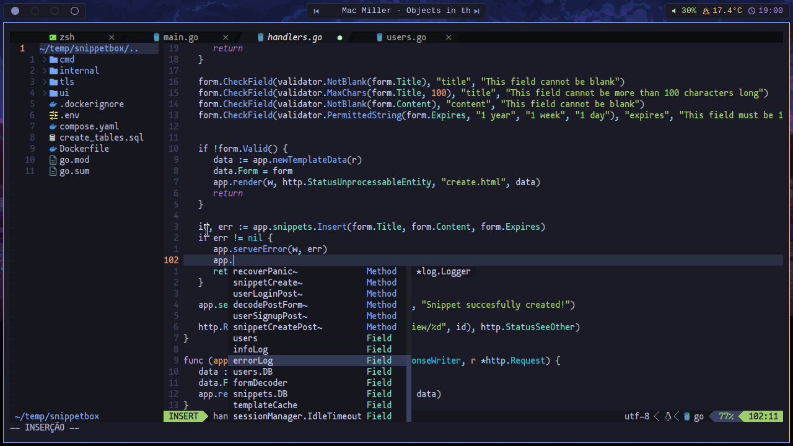
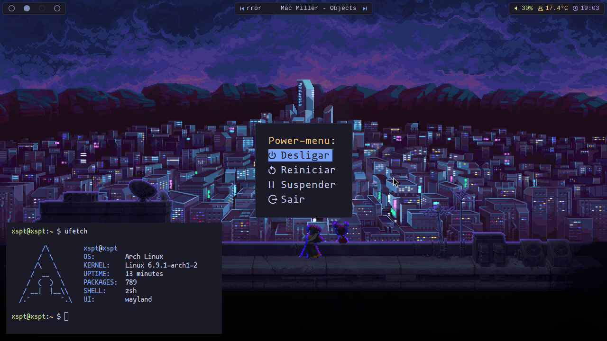

# dotfiles

- **window manager:** [sway](https://github.com/swaywm/sway)
- **code editor:** [neovim](https://github.com/neovim/neovim)
- **program launcher:** [tofi](https://github.com/philj56/tofi)
- **status bar:** [waybar](https://github.com/Alexays/Waybar)
- **colorscheme manager**: [pywal](https://github.com/dylanaraps/pywal)
- **terminal emulator**: [alacritty](https://github.com/alacritty/alacritty)

## install.sh

This script will create symbolic links to your `~/.config` directory (except for .bashrc), will also move existing config files to `$HOME/dotfiles_old`.

## images

